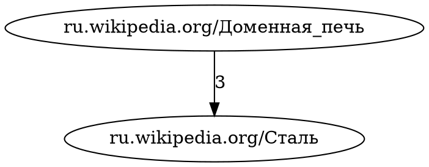

# Лабораторная работа 2

Два задания из лекции «Обзор библиотек Python для сбора и анализа веб-данных».

| Папка | Слайд | Задание |
|---|---|---|
| `task1` | 12 | Паук на Scrapy по официальному туториалу |
| `task2` | 17 | Граф веб-ресурсов по металлургии на языке DOT |

```
lab2/
├── requirements.txt
├── practice2.ipynb                          тетрадь с прогоном обеих задач
├── task1/
│   ├── scrapy.cfg                          точка входа Scrapy
│   └── quotes/
│       ├── settings.py                      настройки проекта
│       └── spiders/quotes_spider.py         сам паук
└── task2/
    ├── main.py                              приложение
    └── sources.txt                          список ресурсов, 51 ссылка
```

## Тетрадь для сдачи

`practice2.ipynb` запускает оба задания и показывает результаты: код паука, собранные
цитаты, лог сбора ресурсов, ключевые термины, самые связанные ресурсы, содержимое
`.dot`-файла и сам граф картинкой.

Чтобы получить сохранённый прогон: открыть тетрадь, `Run All`, дождаться конца и сохранить
файл — выводы ячеек останутся внутри `.ipynb`, и преподавателю не нужно ничего запускать.

---

# Установка

Делается один раз. Все команды — из папки `lab2`.

## 1. Виртуальное окружение

По заданию со слайда 12 — отдельный venv.

```powershell
cd C:\projects\web-mining\lab2
py -m venv .venv
.\.venv\Scripts\Activate.ps1
```

Если PowerShell отказывается запускать `Activate.ps1`, разрешите скрипты для своего
пользователя (один раз, права администратора не нужны):

```powershell
Set-ExecutionPolicy -Scope CurrentUser RemoteSigned
```

Признак, что окружение включилось — приглашение начинается с `(.venv)`.

## 2. Библиотеки

```powershell
pip install -r requirements.txt
```

**Зачем в списке `pymorphy3`.** `rutermextract` тянет `pymorphy2`, а тот падает на
Python 3.11 и новее — внутри он зовёт `inspect.getargspec`, который из Python убрали.
`pymorphy3` — поддерживаемый форк с тем же API, и `task2/main.py` подставляет его
вместо `pymorphy2`. Без него задание просто не запустится.

## 3. Graphviz — только для task2

Пакет `graphviz` из pip — это обёртка, которая вызывает системную программу `dot`.
Саму программу нужно поставить отдельно:

```powershell
winget install graphviz
```

После установки **перезапустите терминал**, иначе `dot` не найдётся в PATH.
Проверка:

```powershell
dot -V
```

Без Graphviz `task2` всё равно отработает и сохранит файл `.dot` — а он и есть
результат по заданию. Не будет только отрисованной картинки.

---

# task1 — паук на Scrapy

Цель обхода — `quotes.toscrape.com`, учебный полигон Scrapy: сайт специально создан
для тренировки скрапинга.

## Запуск

```powershell
cd task1
scrapy list                           # проверка: должно напечатать quotes
scrapy crawl quotes                   # обход с выводом в консоль
scrapy crawl quotes -o quotes.json    # обход с сохранением результата
```

`-o quotes.json` **дописывает** в существующий файл. Чтобы получить чистый результат,
удалите файл перед запуском или используйте `-O quotes.json` (заглавная O — перезапись).

## Что получается

`quotes.json` — список объектов вида:

```json
{
  "text": "“The world as we have created it is a process of our thinking.”",
  "author": "Albert Einstein",
  "tags": ["change", "deep-thoughts", "thinking", "world"]
}
```

## Как это работает

1. `start_urls` — страница, с которой начинается обход;
2. `parse()` вызывается для каждой скачанной страницы;
3. `response.css("div.quote")` находит блоки цитат, из каждого берутся текст, автор и теги;
4. каждый `yield` словаря Scrapy сам складывает в выходной файл;
5. `response.follow()` по ссылке «Next» снова вызывает `parse` — так паук проходит всю
   пагинацию и останавливается, когда ссылки больше нет.

## Настройки в `quotes/settings.py`

| Настройка | Зачем |
|---|---|
| `FEED_EXPORT_ENCODING` | без неё кириллица и типографские кавычки уезжают в JSON как `\u0410\u0411` |
| `USER_AGENT` | на стандартный User-Agent Scrapy многие сайты отвечают 403 |
| `ROBOTSTXT_OBEY` | уважаем правила сайта об обходе |
| `DOWNLOAD_DELAY`, `AUTOTHROTTLE_ENABLED` | пауза между запросами, чтобы не долбить сервер |
| `RETRY_TIMES`, `DOWNLOAD_TIMEOUT` | сеть моргает — запрос повторяется |

---

# task2 — граф ресурсов по металлургии

## Запуск

```powershell
cd task2
python main.py
```

Полный проход по `sources.txt` — это 51 запрос с паузой примерно в секунду, минуты три.

**Запуск можно прерывать и повторять.** Уже собранные ресурсы приложение пропускает —
результат накапливается в `terms.json` между запусками. Это важно потому, что Википедия
режет частые обращения и часть страниц с первого раза не отдаёт: просто запустите ещё раз,
недобранное дособерётся. Чтобы собрать всё заново, удалите `terms.json`.

```powershell
python main.py --min-common 4 --top-terms 30   # строже связи, больше терминов
python main.py --offline                        # перестроить граф без скачивания
python main.py --help                           # все аргументы
```

| Аргумент | Значение |
|---|---|
| `--sources` | файл со списком URL (по умолчанию `sources.txt` рядом со скриптом) |
| `--top-terms` | сколько ключевых терминов брать с ресурса (по умолчанию 20) |
| `--min-common` | сколько общих терминов даёт ребро между ресурсами (по умолчанию 3) |
| `--offline` | не скачивать заново, взять термины из `terms.json` |

## Про 403 от Википедии

Wikimedia требует, чтобы `User-Agent` называл инструмент и давал контакт для связи —
иначе анонимный сбор попадает под лимит и получает `403 Too many requests`.
В `main.py` заголовок уже оформлен по их политике, но контакт там подставной:

```python
HEADERS = {"User-Agent": "lab2-metallurgy-graph/1.0 (educational project; contact: student@example.com)"}
```

Впишите свою почту — так правильнее, и лимит снимается охотнее. Если 403 всё равно
приходит, приложение три раза повторяет запрос с растущей паузой (5, затем 10 секунд),
а что не взялось — доберётся при следующем запуске.

## Что получается

Все три файла появляются рядом с `main.py`:

| Файл | Что это |
|---|---|
| `metallurgy_graph.dot` | граф на языке DOT — **результат по заданию** |
| `metallurgy_graph.dot.svg` | картинка, если установлен Graphviz |
| `terms.json` | какие термины нашлись на каждом ресурсе; вход для `--offline` |

Вид `.dot`-файла:



Узел — веб-ресурс, ребро — общие ключевые термины, число на ребре — сколько их.
Комментарии `//` показывают, о чём каждый ресурс, — по одному `.dot`-файлу видно
и структуру, и содержание.

## Как это работает

1. `read_sources` читает список URL из `sources.txt`;
2. `download` скачивает страницу через `requests`;
3. `extract_text` вытаскивает текст из `p`, `h1`–`h6`, `li`, предварительно выбросив
   `script`, `style`, `nav`, `header`, `footer`, `aside`;
4. `extract_terms` извлекает ключевые термины через `rutermextract` — в нормальной форме,
   то есть «доменные печи» и «доменная печь» считаются одним термином;
5. `find_links` соединяет ресурсы, у которых пересечение множеств терминов не меньше
   `--min-common`;
6. `build_graph` и `save_graph` собирают граф и пишут `.dot` плюс картинку.

## Список ресурсов

В `sources.txt` 51 ссылка при требуемых по заданию 25. Запас нужен потому, что
корпоративные сайты (`nlmk.com`, `severstal.com` и подобные) часто закрыты от роботов
и отдают 403 — такие ресурсы приложение пропускает. Основа списка — энциклопедические
статьи о процессах, агрегатах и предприятиях: они доступны и дают богатую терминологию.

После первого прогона посмотрите строку «Ресурсов в графе». Если их меньше 25,
приложение само об этом скажет — добавьте ссылок в `sources.txt`.

## Настройка результата

Главный рычаг — `--min-common`, порог «считаем ресурсы связанными»:

* граф рассыпался на отдельные узлы → уменьшите `--min-common` или увеличьте `--top-terms`;
* граф превратился в клубок → увеличьте `--min-common`.

Оба случая приложение подсказывает в конце работы.

---

# Если что-то не работает

| Симптом | Причина и что делать |
|---|---|
| `python` пишет «Python was not found» | команда упирается в заглушку Microsoft Store. Запускайте `py` либо выключите псевдонимы в «Параметры → Приложения → Псевдонимы выполнения приложения» |
| `ModuleNotFoundError: No module named 'scrapy'` | не включён venv. `.\.venv\Scripts\Activate.ps1` — в приглашении должно появиться `(.venv)` |
| `AttributeError: module 'inspect' has no attribute 'getargspec'` | не установлен `pymorphy3`. `pip install pymorphy3` |
| `ExecutableNotFound` или «Картинка не отрисована» | нет системного Graphviz. `winget install graphviz` и перезапустить терминал |
| `scrapy list` ничего не печатает | команда запущена не из папки `task1`, где лежит `scrapy.cfg` |
| Кириллица в консоли квадратиками | `chcp 65001` перед запуском |
| В `task2` все ресурсы пропускаются | нет интернета либо сайты недоступны — в выводе видно причину по каждому URL |
| `403` почти на каждой странице Википедии | сработал лимит Wikimedia. Впишите свою почту в `HEADERS` и запустите ещё раз — собранное сохраняется |
| `UnicodeEncodeError: 'latin-1' codec can't encode` | в `HEADERS` попала кириллица. HTTP-заголовки допускают только latin-1 — `User-Agent` должен быть на латинице |
