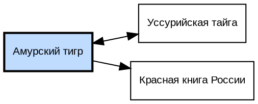

# Лабораторная работа 3: Wikimedia API

Сборщик данных о предметной области через API проектов Wikimedia.
На вход — запрос о личности, объекте, событии или животном. На выход — JSON со статьями,
изображениями и гиперссылками плюс граф связей на языке DOT.

```
lab3/
├── main.py             сборщик: CLI, граф, сохранение результатов
├── wikimedia.py        все обращения к API Wikimedia
├── test_main.py        юнит-тесты (31 штука, сеть не нужна)
├── requirements.txt
├── practice3.ipynb     тетрадь с прогоном и сохранёнными результатами
└── output/             создаётся при запуске, по папке на запрос
```

Задействованы все четыре проекта, которых требует задание:

| Проект | Что берём | Метод API |
|---|---|---|
| Википедия | статьи, тексты, гиперссылки, изображения, языковые версии | `action=query` + `prop=extracts\|links\|pageimages\|langlinks` |
| Викиданные | метка, описание, синонимы, свойства сущности | `action=wbgetentities` |
| Викисловарь | толкование слов запроса | `action=query&prop=extracts` |
| Wikimedia Commons | изображения по теме, картинка дня | `generator=search` и Feed API |

---

# Установка

```powershell
cd C:\projects\web-mining\lab3
py -m venv .venv
.\.venv\Scripts\Activate.ps1
pip install -r requirements.txt
```

Если PowerShell отказывается запускать `Activate.ps1`:
`Set-ExecutionPolicy -Scope CurrentUser RemoteSigned`.

Для картинки графа нужна ещё системная программа `dot` — пакет `graphviz` из pip только
вызывает её:

```powershell
winget install graphviz
dot -V
```

После установки перезапустите терминал. Без `dot` сборщик всё равно отработает и сохранит
`graph.dot` — это и есть результат по заданию, не будет только SVG.

---

# Запуск

```powershell
python main.py "Амурский тигр"
```

Один запуск — это около сорока запросов к API с паузой, примерно полминуты.

```powershell
python main.py "Амурский тигр" --articles 50        # больше статей в графе
python main.py "Пермь" --lang ru --images 20        # другая тема, больше изображений
python main.py "Siberian tiger" --lang en           # англоязычная Википедия
python main.py "Амурский тигр" --skip-potd          # без картинки дня
python main.py --help
```

| Аргумент | Значение |
|---|---|
| `query` | запрос: личность, объект, событие, животное (обязательный) |
| `--lang` | язык Википедии и Викисловаря, по умолчанию `ru` |
| `--articles` | сколько статей собрать, по умолчанию 40 (по заданию минимум 30) |
| `--images` | сколько изображений брать с Commons, по умолчанию 10 |
| `--skip-potd` | не скачивать картинку дня |

Значения по умолчанию в этой таблице — ровно те, с которыми получены файлы в `output/`
и выводы в `practice3.ipynb`.

---

# Что получается

Всё складывается в `output/<запрос>/`:

| Файл | Что это |
|---|---|
| `result.json` | статьи с текстами и ссылками, Викиданные, Викисловарь, изображения |
| `graph.dot` | граф связей на языке DOT — **результат по заданию** |
| `graph.dot.svg` | картинка графа, если установлен Graphviz |
| `errors.json` | какие запросы не прошли: этап, адрес, ошибка |
| `potd/<имя>.jpg` | картинка дня |
| `potd/<имя>.txt` | её описание, имя файла то же, отличается только расширение |

## Структура result.json

```json
{
  "query": "Амурский тигр",
  "collected_at": "2026-09-25",
  "root": {
    "title": "Амурский тигр",
    "url": "https://ru.wikipedia.org/wiki/Амурский_тигр",
    "extract": "Амурский тигр — подвид тигра...",
    "image": "https://upload.wikimedia.org/...jpg",
    "language_versions": [{"lang": "en", "title": "Siberian tiger", "url": "..."}]
  },
  "wikidata": {
    "id": "Q26833", "label": "амурский тигр", "description": "подвид тигра",
    "aliases": ["уссурийский тигр"], "properties": {"P31": ["Q16521"]}, "sitelinks": 60
  },
  "wiktionary": [{"word": "тигр", "definition": "тигр — крупное хищное млекопитающее..."}],
  "commons_images": [{"title": "File:...", "url": "...", "description": "...", "license": "..."}],
  "picture_of_the_day": {"title": "...", "url": "...", "saved_image": "...", "saved_description": "..."},
  "articles": [{"title": "...", "url": "...", "extract": "...", "links": ["..."]}],
  "graph": {"nodes": 40, "edges": 61, "isolated": []}
}
```

## Вид graph.dot



Узел — статья Википедии, ребро — гиперссылка между двумя статьями из выборки.
Корневая статья подсвечена.

---

# Как это работает

1. `search_article` находит корневую статью по запросу;
2. `collect_titles` берёт её гиперссылки, отбрасывает мусорные и выбирает из оставшихся
   равномерную выборку нужного размера;
3. `collect_links` для каждой статьи запрашивает её ссылки и оставляет только те, что ведут
   внутрь выборки — из них и строятся рёбра;
4. `articles_content` одним запросом на 20 заголовков забирает тексты, картинки и
   идентификаторы Викиданных;
5. `wikidata_entity`, `wiktionary_definition`, `commons_images` добирают данные из остальных
   трёх проектов;
6. `build_graph` и `save_graph` собирают граф и пишут `.dot` плюс картинку.

## Почему граф направленный

В прошлой лабораторной ребро означало «у двух сайтов есть общие термины» — отношение
симметричное, и направленный граф там был ошибкой. Здесь ребро — это гиперссылка, а она
направлена по своей природе: из статьи «Амурский тигр» есть ссылка на «Красную книгу
России», обратной ссылки может не быть.

Поэтому граф направленный, но взаимные ссылки не дублируются: пара A→B и B→A рисуется
одним ребром с `dir=both`, то есть стрелкой в обе стороны. В выводе видно оба случая.

## Что отфильтровывается

Гиперссылки Википедии наполовину состоят из служебных связей, которые соединяют статьи
формально, а не по смыслу. Не попадают в граф:

* служебные пространства имён — `Категория:`, `Шаблон:`, `Файл:`, `Служебная:`, `Портал:`,
  `Проект:`, `Википедия:`, `Обсуждение`, `Участник:`, `Модуль:` и их английские аналоги;
* даты и годы — `1947 год`, `2022`, `15 сентября`, `XIX век`, `1990-е`;
* списки и перечни — `Список млекопитающих России`, `List of mammals`.

Выборка статей берётся равномерно по всему списку ссылок, а не подряд: API отдаёт ссылки
в алфавитном порядке, и первые 40 дали бы статьи только на первые буквы.

## Диагностика

* `errors.json` — список неудачных запросов с этапом и текстом ошибки. Если статей
  собралось меньше ожидаемого, причина видна здесь.
* Сборщик сам сообщает, если статей меньше 30 (минимум по заданию) и если в графе есть
  изолированные узлы — статьи без связей с остальной выборкой.
* Wikimedia ограничивает частоту анонимных обращений. `User-Agent` оформлен по их политике,
  при `403`/`429` запрос повторяется три раза с растущей паузой.

---

# Тесты

```powershell
python -m pytest -q
```

31 тест, сеть не нужна — API подменяется через `monkeypatch`. Проверяются фильтрация
мусорных заголовков, равномерная выборка, сборка рёбер только внутри выборки, склейка
взаимных ссылок в одно ребро `dir=both`, поиск изолированных узлов, структура `result.json`,
разбор свойств Викиданных и имена файлов, безопасные для Windows.

---

# Картинка дня

Дополнительная функция задания. Берётся через Feed API из API Portal:

```
https://api.wikimedia.org/feed/v1/wikipedia/ru/featured/2026/09/25
```

Ответ сразу содержит и прямой адрес файла, и описание, и автора с лицензией. В примере
с лекции адрес картинки собирался вручную из md5-хэша имени файла — через Feed API этого
не нужно, адрес приходит готовым. Если для русского языка ответа нет, запрос повторяется
для английского.

Картинка и описание сохраняются рядом в `output/<запрос>/potd/`, имя текстового файла
совпадает с именем картинки. Два момента, о которые это спотыкается:

* Feed API дописывает к адресу utm-метки (`?utm_source=commons.wikimedia.org&...`), поэтому
  имя файла берётся только из пути ссылки, а не из неё целиком.
* Символы, недопустимые в именах файлов Windows (`: ? * " < > |`), заменяются на
  подчёркивание — иначе файл вида `Panorama: Volga.jpg` не создаётся.

Оригиналы картинки дня — это панорамы на десятки мегабайт, и `upload.wikimedia.org`
отдаёт их не всегда. Запрос повторяется три раза при `403`/`429`, а если оригинал так и
не пришёл, скачивается превью под тем же именем. Что именно не удалось — с кодом ответа
видно в `errors.json`.

---

# Если что-то не работает

| Симптом | Причина и что делать |
|---|---|
| `python` пишет «Python was not found» | заглушка Microsoft Store. Запускайте `py` или выключите псевдонимы в «Параметры → Приложения → Псевдонимы выполнения приложения» |
| `ModuleNotFoundError` | не включён venv: `.\.venv\Scripts\Activate.ps1`, в приглашении должно появиться `(.venv)` |
| `ExecutableNotFound` или «Картинка не отрисована» | нет системного Graphviz: `winget install graphviz` и перезапустить терминал |
| «статья не найдена» | запрос слишком узкий, попробуйте более общую формулировку |
| Статей меньше 30 | у корневой статьи мало ссылок — возьмите более общую тему или поднимите `--articles` |
| Много записей в `errors.json` | сработал лимит Wikimedia, запустите ещё раз через минуту |
| Картинка дня не сохранилась | смотрите `errors.json`: этап `potd` — не пришёл ответ Feed API, `potd-image` — не отдался файл картинки. Код ответа там же |
| Кириллица в консоли квадратиками | `chcp 65001` перед запуском |
